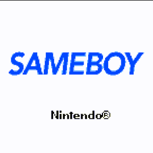

Work in progress of my 1st Gameboy game.
Without pretention, just for fun and learning.

<div align="center"></div>

# To do

:ballot_box_with_check: manage collisions with background<br>
:radio_button: add a cat<br>
:radio_button: change player colors and hair + correction of the animation, test with the little gb<br>
:radio_button: refacto and comments<br>
:radio_button: add a roomate<br>
:radio_button: add a title screen with a press start, splash screen with fadding palette, something pretty, etc<br>
:radio_button: add a gif in this readme of the game/titlescreen<br>
:radio_button: adding some text and intercations with items<br>
:radio_button: adding sound<br>
:ballot_box_with_check: tidy up the files + comments<br>
:ballot_box_with_check: create and animate a real sprite <br>
:ballot_box_with_check: pimper les Makefile<br>

:radio_button: exterior with a scroll (! the player moves with the screen limits)<br>

### How launch my 'game' (not so much a game for now :) )

<b>To lauch:</b>

````
git clone https://github.com/Mel-louie/Gameboy_GBDK-N.git
cd 'to-the-directory'
make
````
And you can launch the .gb with your favorite Gameboy emulator!

<b>To delete the binaries, .asm, etc:</b>

````
make clean
````

<b>To delete all, including the game.gb:</b>

````
make fclean
````

### Ressources

<h6>Tutorials</h6>
<a href="https://blog.flozz.fr/category/gameboy.html">Tuto to gbdk-n</a> in French by <a href="https://github.com/flozz">@flozz</a><br>
<a href="https://www.youtube.com/playlist?list=PLz2msaUAjsFdrg0jOQGWFzjiKZnB1o9od">Tuto to gbdk-n</a> videos in French by <a href="https://github.com/flozz">@flozz</a> and Studio Renegade<br>
<a href="https://www.youtube.com/watch?v=HIsWR_jLdwo&list=PLeEj4c2zF7PaFv5MPYhNAkBGrkx4iPGJo">Playlist of tutorials</a> in English to learn how to use GBDK and create a GameBoy game.<br>

<h6>Tools and ressources</h6>
Tool to convert images to tilesets/sprites: <a href="https://github.com/flozz/img2gb">img2gb</a> by <a href="https://github.com/flozz">@flozz</a><br>
Pokemon tileset: <a href="https://www.spriters-resource.com/">The Spriters ressources</a>, <a href="https://tcrf.net/The_Cutting_Room_Floor">The Cutting Room Floor</a><br><br>
To create pixel art (maps, backgrounds, sprites, etc):
<ul>
	<li><a href="https://www.gimp.org/downloads/">GIMP</a>;</li>
	<li><a href="https://lospec.com/">lospec.com</a>: tutorials, ressources and online pixel art editor;</li>
</ul>

<h6>Emulator</h6>
An <a href="http://gb.alexaladren.net/">emulator</a> in js, online
An other <a href="https://toadking.com/retroarch/gambatte.html">emulator</a> in js, online


<!-- https://opengameart.org/content/top-down-pokemon-esque-sprites -->
<!-- https://opengameart.org/content/parallax-city-night-4-colors -->
